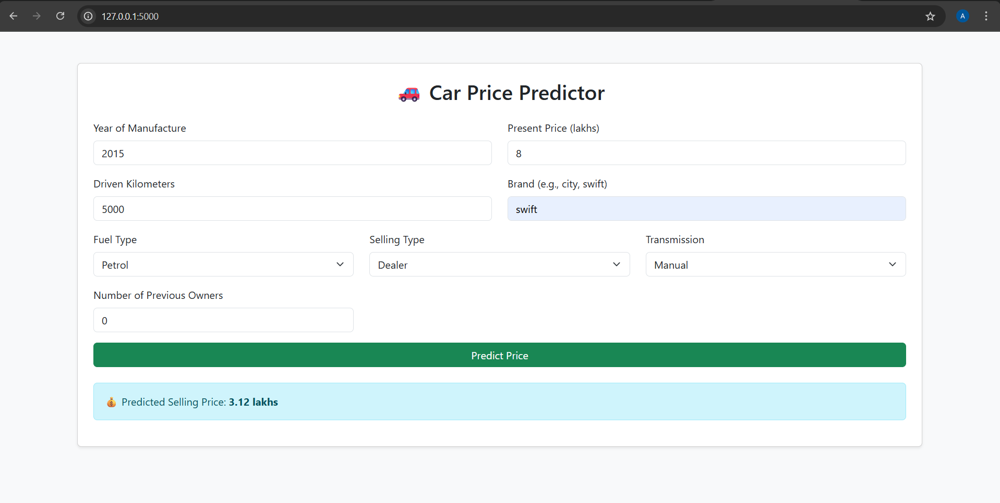

# 🚗 Car Price Prediction Web App
[](https://github.com/AnkitKumarIISERB)

A **machine learning-powered** Flask web application that predicts the **selling price of a car** based on user inputs like manufacturing year, kilometers driven, fuel type, and more.

---

## 📂 Project Structure

├── app.py # Flask web application
├── best_car_price_model.pkl # Trained ML model
├── car_data.csv # Dataset used for training
├── car_price_prediction.ipynb # Jupyter Notebook for model training
├── requirements.txt # Required dependencies
├── README.md # Project documentation
├── LICENSE # MIT License
├── templates/ # HTML templates for the web app
└── demo.png # Demo screenshot of the app
 
---

## 🖼 Demo

Here’s how the Car Price Prediction app looks in action:



---

## ⚙ Features

- 📊 **ML Model** trained on car price dataset
- 🌐 **Interactive Web App** built using Flask & Bootstrap
- 🔮 Predicts selling price in **Lakhs**
- 🖥 **User-friendly UI** for quick predictions

---

## 🛠 Installation

1. **Clone the repository**
   ```bash
   git clone https://github.com/your-username/CodeAlpha_Car_Price_Prediction.git
   cd CodeAlpha_Car_Price_Prediction
2. **Install dependencies**

   ```bash
   pip install -r requirements.txt
3. **Run the Flask app**

   ```bash
   python app.py
4. **Open your browser and go to:**

   ```cpp
   http://127.0.0.1:5000

---

## 📜 License

This project is licensed under the MIT License - see the LICENSE file for details.

---

## 📧 Contact

Created by Ankit Kumar (IISERB) — feel free to reach out!

---
